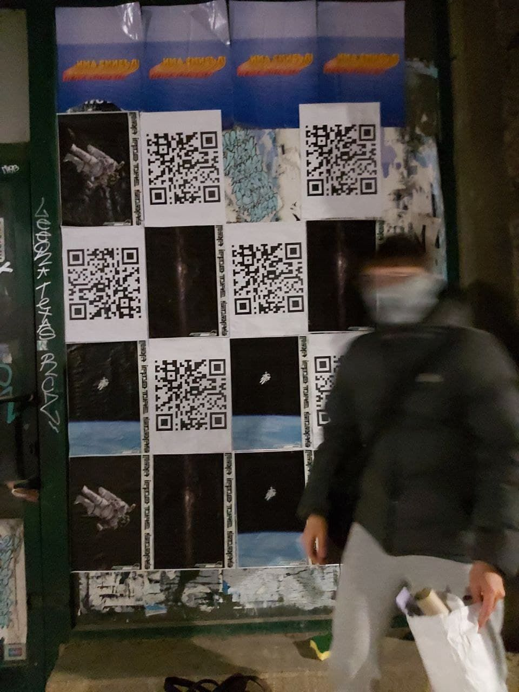
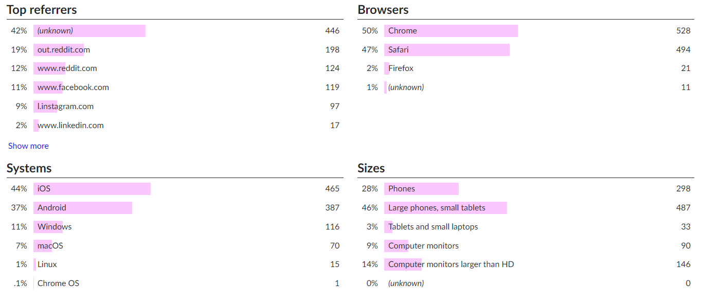

# Experience the project

>**[>>>STARGAZING LINK](https://gekolev.github.io/space/)**

I have always wanted to explore the galaxy in an engaging way. Books and movies seemed a little too boring for me. I decided to create something that would entertain me and a few of my friends. Hopefully anybody who finds it too.

### Backwards engineering

I limited myself and wanted the project to have a narrow scope. I aimed to create a single page experience, which had some charm. I didn't want people to see it as just a website. My time when creating this project was very limited due to my work duties, therefore some sacrifices in terms of readability and sustainability of code had to be made. Spreading the project was also important to me threfore I designed a few posters and put them up around my city alternating them with a QR code that links directly to the site.   **tldr;  I dumped everything into an index.html and spread QR codes around.**

### 1500+ Project views

I used GoatCounter in order to collect some data about the users viewing my project. Most of the visits I got seemed to come from people scanning the QR code, which was really cool and inspiring especially since I only printed 6 code posters. These analytics tools helped me understand who had seen the project and what device they were using. Views seemed to peak on weekends, which was probably due to the QR code scanning 

### 360 image

One of the most crutial resources was the 360 image I chose for the project. It needed to be high resolution, but most importantly it needed to be configured in order to work well with the three.js framework. This was conducted trough a lot of trial and error.

