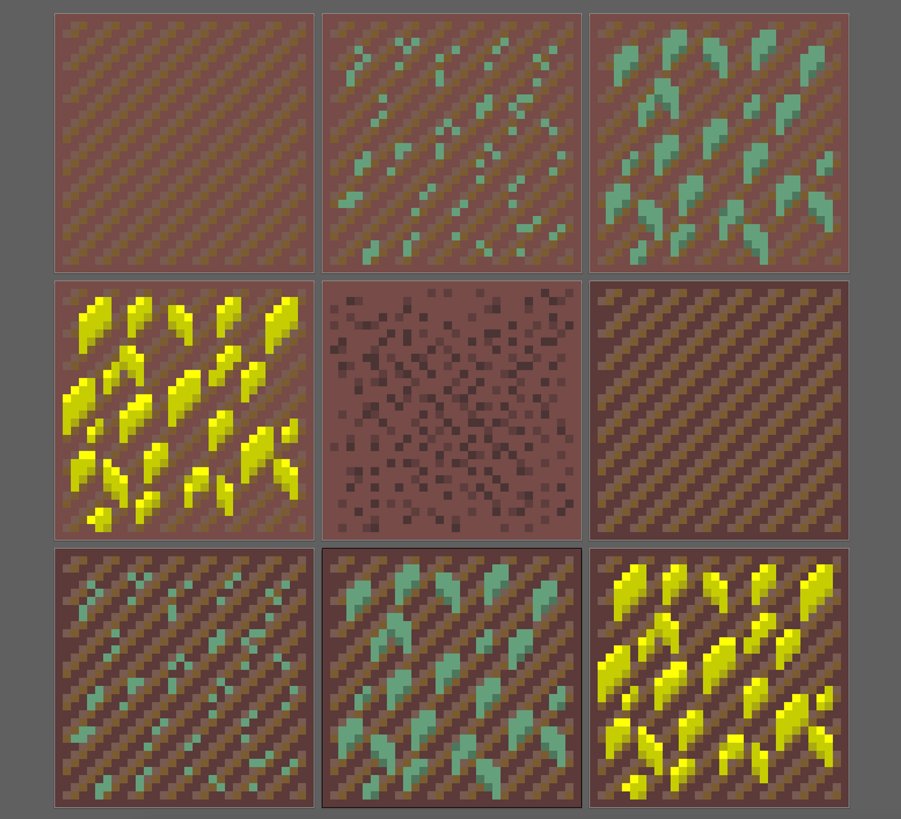
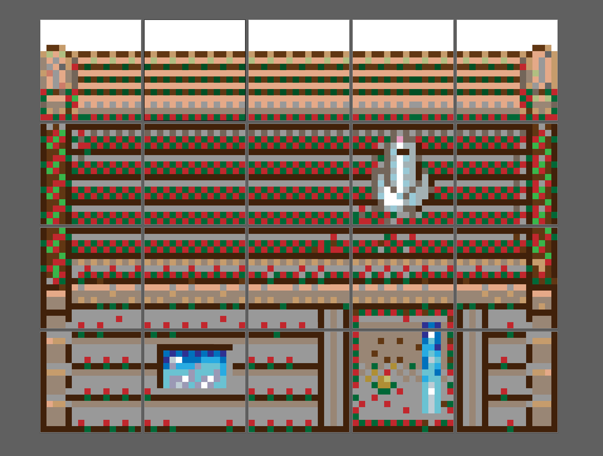
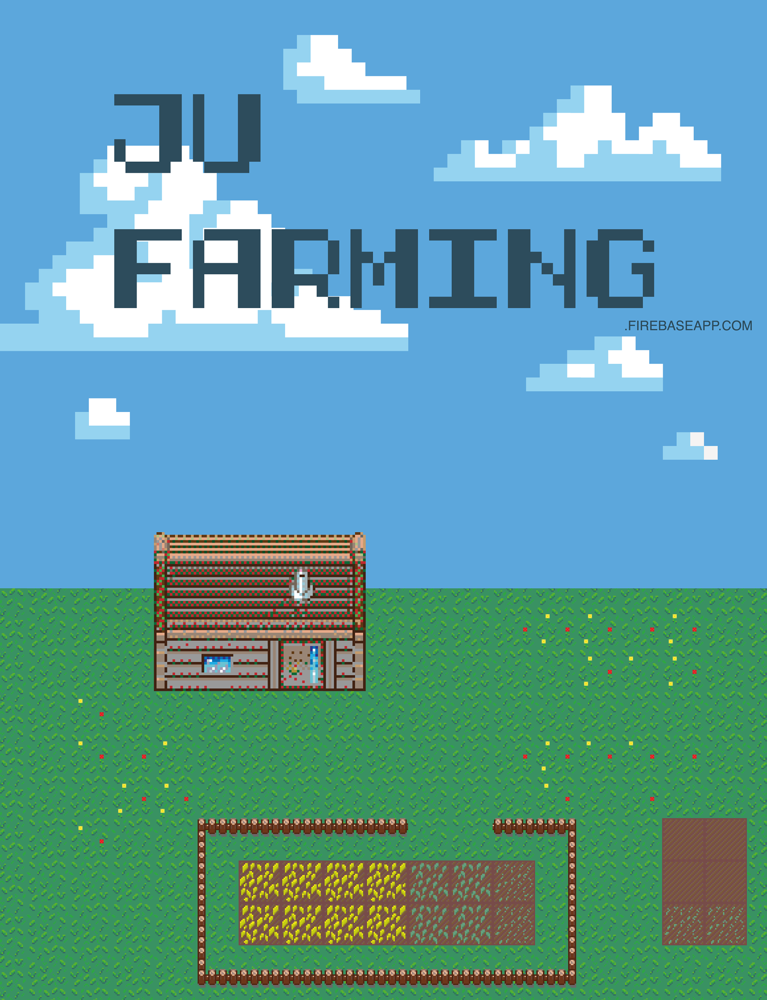

Special thanks to the amazing Antonia Ziegler and Jordan Atanasov who made this possible. We worked as a group on this project and without their expertise and resilience it would not have been the same.

A simple farming game showcasing the possibilities of using a powerful JavaScript library like Phaser and Firebase Realtime Database. Heavily inspired by Stardew Valley. Made for a university assignment. We created all of the visuals and mechanics of the game ourselves. It was a very challenging project and we all learned so much. My favourite part was animating the movements of the character. The character is a space farmer with an overall. The color of the overall can be changed depending on the settings you choose when you register in the game. We divided them in color categories coresponding to the colors of the overalls of the different schools we have on campus.

Whatever description I put it will not make it justice. [Just try the game.](https://jufarming.firebaseapp.com/) (Desktop only) 

**Video Demo**

<iframe src="https://player.vimeo.com/video/338441588" width="640" height="478" frameborder="0" allow="autoplay; fullscreen; picture-in-picture" allowfullscreen></iframe>

We had to create different colored sprite sheets for the different characters you could play. We played a lot with the size and movement of the character in order to finally get it looking right.Our little space farmer turned out great in the end!

