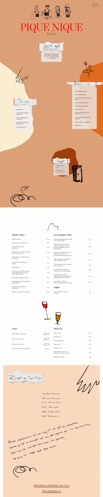

During my internship (at [ny](https://www.ny.se/)) I worked on one client project. I was the sole developer for this one page website. It was my first time using php and WordPress. In terms of plugins I used Advanced Custom Fields mainly. And all other SEO and other stuff related plugins which I dont really understand. I worked closely with an Art Director and collaborated with her on most things.

We worked in Figma for the design and layout. We used Lottie Animations for the animated effects on the website. A motion designer from the studio created the animations and exported them as json files which I imported trough a Lottie Player on the site. It was really easy to do and I would definitely use Lottie again.

You can learn more about my internship experience [here](https://ny.se/intern/george-kolev/).

>First experience with lottie animations!

The site is also live [here](https://www.piquenique.se/).

